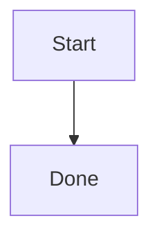

# Markdown 编辑器模型 - 多标签文件打开与切换

本文档描述编辑器中“顶部标签栏 + 多文件编辑”交互的行为。

## Agent 对话框原型

- 编辑器支持唤起浮动 Agent Palette：
  - 当编辑器内存在文字选区且仅打开 prompt 时，浮层会读取当前浏览器选区最后一行的矩形，并定位在该行正下方；此阶段只做边界收敛，不主动滚动编辑器；
  - 当没有有效选区时，浮层出现在编辑区中上方的居中位置；
  - 当用户发送消息或从折叠状态重新打开对话画布时，编辑滚动区会先把选区最后一行滚动到默认 Agent 位置的上方，再让 prompt 框贴在最后一行下方，避免画布展开后浮层出现在过低的位置；
  - 画布展开定位使用同步滚动后再重新计算位置，避免长距离平滑滚动尚未完成时 prompt 停在旧坐标；代码块和块级内容会优先使用选区起止点的折叠光标 rect，必要时再过滤整块容器 rect，只使用真实文本行 rect 定位。
  - 当画布折叠回 prompt 时，编辑器会尽量反向滚动以展示更多被选中文本；如果选区已经完整可见，或 prompt 已经到达最低安全位置，则停止移动；
  - 浮层 X 轴始终按当前编辑器视口居中，不跟随选区最后一行的横向位置，并根据编辑器视口宽度收敛自身宽度，避免超出编辑器区域。
  - Agent 打开后会用浏览器 CSS Highlight API 保留选中文本的浅蓝选中效果，避免 prompt 获得焦点后用户失去上下文。
- 当前原型监听 `Fn` 键；由于不同系统和 Electron 版本可能不会向渲染进程暴露独立 `Fn` 事件，主进程也会通过 `before-input-event` 尝试捕获并转发，同时提供 `Cmd/Ctrl + J` 作为开发验收兜底快捷键。
- Prompt 框包含：
  - 左侧 `+` 菜单，当前支持 `Web Search` 复选开关和本地文件选择；
  - 模型选择菜单，提供 `Lite`、`Pro`、`Ultra` 三档模型，并用不同图标与颜色标识，默认使用 `Lite`；
  - 主按钮在输入为空时展示语音模式，点击后切换到居中的波形动画，再次点击后模拟识别并回填文字；
  - 主按钮左侧的麦克风按钮用于“语音转文字”模式，prompt 框保持文字输入状态，按钮仅通过 icon 颜色展示浅蓝到蓝色的呼吸动画；再次点击后结束识别，并把文字插入当前光标位置；
  - 输入框自动随内容增高，最多显示四行，超过四行后进入内部滚动。
- 附件以 prompt 内部标签展示，并经过 `Uploading -> Parsing -> Recording -> Ready` 四个本地状态；当前原型只记录文件名、类型和展示状态，尚未接入真实上传、解析或索引服务。
- 发送消息后，prompt 下方展开固定高度的对话画布：
  - 每一次用户提问和 AI 回复组成一张 `qa-paper`，画布使用纵向滚动与 scroll snap，让新对话像纸张一样顶上来；
  - 新发送的对话纸张会从下方轻微上推动画进入，强化“新纸张顶上来”的卷轴感；
  - 用户消息使用带边框气泡，AI 消息直接铺在画布上，两者保持明显视觉区分；
  - 用户消息左下方按便当布局展示本轮附件，附件名过长时省略；
  - 用户消息右下方提供撤销、复制、编辑按钮，其中复制会写入剪贴板，编辑会让消息进入可编辑状态，并允许删除本轮附件；
  - 编辑确认后会用修改后的 prompt 和附件重新生成当前原型回复。
- Agent 已接入后端流式事件通道，AI 回复会在同一条消息中按 `delta` 增量显示，完成后标记为完整状态，错误时展示错误文本并触发 toast。
- AI 回复内容复用编辑器侧 `rich-markdown` 的 Markdown 渲染与 HTML 清洗能力，支持段落、列表、标题、引用、代码块、Mermaid 图表和表格等基础 Markdown；AI 回复完成后才会在回复下方显示复制按钮，用于复制原始 AI 回复文本。
- AI 回复完成后，复制按钮右侧提供 `Insert` 按钮：
  - 点击后以 Markdown 源码为唯一正文真相执行插入：先计算目标文档的源码插入位置，再把 AI 回复的原始 Markdown 片段写入当前草稿，避免由 TipTap 重新序列化整篇文档造成代码围栏、表格、HTML、空行或缩进格式丢失；
  - 插入位置使用块级边界：如果光标位于代码块、表格、标题、列表或普通非空段落内部，AI 回复会插入到当前块之后；空文档或空段落会直接放入当前位置；
  - AI 回复源码只做最小规范化：统一换行为 `\n`，去掉首尾空白行，保留内部 Markdown 结构；
  - 渲染视图中的蓝色效果不是 Markdown 语法，而是根据 sidecar provenance range 把对应内容恢复为 Veloca 内部 `velocaAiGeneratedBlock`，并给 AI 原文文本应用内部 `velocaAiGenerated` mark，再由 `.veloca-ai-generated-text` 使用 `--info` 蓝色下划线展示；
  - Markdown 正文保持纯净，保存时不会写入 Veloca 专属语法、HTML 标记或隐藏注释；
  - 插入成功后会立即更新 Markdown 草稿；如果用户未在渲染视图继续编辑，切换源码模式不会再强制把 TipTap 文档重新序列化回 Markdown；
  - AI 内容来源保存为 `document_provenance_snapshots` sidecar v2 结构，复用现有 `snapshot_json` 字段记录 `version: 2`、`markdownHash`、AI range、原始片段 hash、渲染快照、每个 AI range 内的 `editedRanges`，以及用于兼容恢复蓝/黄 mark 的 `markSnapshot`，不需要数据库迁移；
  - 用户在源码模式编辑时，Veloca 会把源码变更转换为最小 Markdown patch，并同步移动或更新 v2 provenance range；如果编辑发生在 AI range 内，插入或替换出来的字符区间会被精确写入该 range 的 `editedRanges`；
  - 用户在源码模式直接修改 AI range 内的内容时，只有新增或替换出来的源码片段会显示黄色底线，插入点之后未被修改的原文仍保持蓝色；删除内容不会让剩余原文误变黄；
  - 打开文档或源码被外部改写后，Veloca 会先按 hash 校验 provenance；不匹配时尝试用原始 AI Markdown 片段做唯一匹配重定位，无法唯一定位的 range 会被丢弃，避免把普通内容误判为 AI 内容；
  - 用户在 AI 生成块内新增或替换的文字会自动应用内部 `velocaAiEdited` mark，并将对应文字下划线改为黄色；删除内容不会标记剩余原文；
  - 渲染视图中编辑过 AI 内容后，切换源码或保存时会从当前 TipTap `velocaAiGeneratedBlock` 快照反推最新 v2 range，把用户改写后的 Markdown 片段作为新的 `rawMarkdown`，并连同蓝色原文 mark 与黄色编辑 mark 一起写入 sidecar；
  - 如果用户在渲染视图继续编辑，编辑器仍会把渲染态内容同步回 Markdown 草稿，并尽量保留 v2 provenance range；同步时必须序列化完整 TipTap `doc` 节点，不能只序列化 `doc.content` 数组，否则段落、标题、列表、表格之间的块级空行会被压扁。
  - 渲染视图编辑过程中，如果 Markdown 正文已经和当前草稿一致，且当前 TipTap 文档已经带有需要的 AI provenance mark，后续 sidecar 变更不会再次整篇 `setContent`，避免光标或视图在输入时跳到文末。
- 画布浮动按钮有两种互斥状态：当用户离开最新对话纸张时，底部显示 `Back to latest`；当用户仍在最新对话但上滑打断流式自动贴底时，底部显示仅含图标的恢复自动滚动按钮。
- 用户发送新消息或点击 `Back to latest` 会进入自动贴底状态；流式输出期间会持续滚动到最新内容底部，用户上滑会打断该状态，用户滚到画布底部或点击恢复按钮会重新进入该状态。
- 画布左上 session 控件和右上折叠控件在打开或发送后短暂出现，用户 4 秒无画布操作后上滑淡出；用户上滑查看历史内容时重新出现，向下滚动时隐藏。
- 对话画布右上角按钮用于折叠画布；折叠后，如果当前 session 已有消息，prompt 工具栏右侧会出现历史按钮用于重新展开。
- `Back to latest` 只会在当前 session 至少有两轮对话，且用户滚动到非最新纸张时，从画布底部弹出。
- 对话画布左上角提供 session 控制菜单，第一个 item 固定为 `New Session`，后续 item 为从本地 `otherone-agent` 记忆中恢复的已有 session；新建 session 会通过后端 IPC 落入 Agent 本地文件存储。
- 当前 Agent 回复已经接入后端流式 Agent 服务；语音识别、Web Search 和附件真实解析仍为前端原型状态，后续需要替换为后端 API、请求拦截器和统一消息组件处理。

## Mermaid 图表渲染

- 编辑器内新增 Mermaid 图表块使用 slash command：
  - 在根级段落输入 `/` 时会打开指令选择弹层，继续输入 `/m` 会筛选出 Mermaid 指令；弹层支持鼠标点击、方向键、`Enter` 和 `Tab` 选择；
  - 在根级段落输入 `/mermaid` 并按 `Enter` 时，当前段落会替换为 Mermaid 图表块；
  - 在已有正文末尾输入 ` /mermaid` 并按 `Enter` 时，正文会保留，Mermaid 图表块会插入到下一行；
  - `正文/mermaid`、`/mermaid extra` 或命令后继续输入其他字符时都保留为普通内容。
- 同一指令弹层现在包含 `Table` 和 `Code Block`：
  - 选择 `Table` 或输入 `/table` 后会创建一个空的 `2 × 2` 表格，正文后缀命令会保留正文并将表格插入到下一行；
  - `Code Block` 先仅作为指令集条目展示，具体代码块插入行为后续实现。
- 保存后的 Markdown 仍使用标准 fenced code block 形式的 Mermaid 图表：

````markdown

````

- Markdown 进入编辑器时，根级 `mermaid` 代码围栏会转换为 `velocaMermaid` 原子块节点；普通语言代码块继续使用现有 Shiki 代码块，不改变原有代码块体验。
- `velocaMermaid` 节点默认显示渲染后的图表卡片；用户点击 `Edit` 后进入源码编辑状态，点击 `Save` 后更新图表源码并重新渲染，点击 `Cancel` 放弃本次编辑。
- 保存和导出编辑器 Markdown 时，Mermaid 节点始终序列化回标准 ` ```mermaid ` fenced code block，不写入 Veloca 内部 HTML 结构，保证文档可被其他 Markdown 工具读取。
- Mermaid 渲染使用官方 `mermaid` 包动态加载，避免拖慢编辑器初始启动；当前依赖为 MIT license，可用于商业项目。
- 安全策略集中在 `rich-markdown`：
  - Mermaid 使用 `startOnLoad: false`、`securityLevel: 'strict'`、`htmlLabels: false`；
  - Mermaid 输出 SVG 写入 DOM 前会再次经过 DOMPurify 清洗；
  - 禁止 `script`、`foreignObject`、事件属性和 `srcdoc` 等高风险内容。
- Agent 回复中的 Mermaid 围栏会先渲染为安全占位块，React 挂载后再异步 hydrate 为 SVG；如果渲染失败，回复区显示错误状态并保留源码内容，复制回复时仍复制原始 AI Markdown。
- Mermaid 图表渲染跟随当前深色/浅色主题；主题切换后，新渲染的图表使用对应 Mermaid theme。

## 打开文件与标签

- 文件树点击某个 Markdown 文件时，采用“打开/聚焦”策略：
  - 如果该文件已在 `openTabs` 中，直接激活或创建它对应的单文件组合，并恢复该标签的 `draftContent`；
  - 否则读取文件后新增 `openTabs` 内容项，并新增单文件组合。
- 文件树右键菜单通过 portal 渲染在页面根部：
  - 菜单项点击前会先触发浏览器 `mousedown`，因此菜单容器必须阻止内部 `mousedown` 冒泡，避免全局关闭监听在 `click` 之前卸载菜单；
  - 文件夹节点菜单支持新建文件、新建文件夹、粘贴、打开/定位、复制路径，以及非工作区根节点的复制、剪切、复制副本、重命名和删除；
  - 新建条目时先展开目标文件夹，创建成功后刷新 workspace snapshot，并进入 inline rename 状态。
- 由 `openTabs: OpenEditorTab[]`、`tabGroups: string[][]` 与 `activeTabPath: string | null` 统一管理当前打开集合、顶部选择栏组合和当前激活文件。
- `activeFile` 不再作为独立状态维护，始终由 `activeTabPath` 在 `openTabs` 中派生。
- `openTabs` 中每个文件只保存一份内容状态；同一个文件可以出现在多个 `tabGroups` 组合里。

## 草稿与切换

- 切换标签时不弹出“放弃修改”确认框，当前标签草稿会被保留在内存中。
- 每个标签保存三类状态：
  - `draftContent`：编辑缓冲内容；
  - `savedContent`：上次成功保存的内容；
  - `status`：`saving` / `saved` / `unsaved` / `failed`。
- `updateDocumentContent` 每次编辑时同时更新 `documentContent` 与对应标签的 `draftContent`。

## 源代码 / 渲染视图

- 编辑器右上角保存按钮左侧提供内容视图切换按钮：
  - 默认使用渲染视图，按钮显示代码图标，点击后进入 Markdown 源代码视图；
  - 源代码视图使用可编辑 textarea 展示当前文件原始 Markdown 内容，按钮显示文档图标，点击后回到渲染视图。
- 视图模式按文件路径独立记录：
  - A 文件切到源代码视图不会影响 B 文件；
  - 分屏模式下左右文件也分别读取各自的视图模式。
- 源代码视图仍复用当前草稿和保存链路：
  - textarea 输入会更新 `draftContent`、`documentContent` 和对应标签 `status`；
  - 自动保存、手动保存、关闭未保存确认和状态栏统计继续使用同一份 Markdown 内容。
- 切换视图时会尽量保持文本焦点位置：
  - 渲染视图切到源代码视图时，TipTap 编辑器会临时插入唯一 cursor marker，序列化为 Markdown 后计算 marker offset，再移除 marker；
  - 源代码视图切回渲染视图时，textarea 的 `selectionStart` 会作为 Markdown offset，通过临时 marker 恢复到 TipTap 文档中的相近位置；
  - 源代码视图切回渲染视图时，临时 marker 文档只用于定位光标；定位完成后必须恢复原始 provenance snapshot，避免把带黄色 `velocaAiEdited` mark 的 AI 内容替换成由 range 重建出来的全蓝 AI block；
  - 如果 offset 落在 Markdown 语法边界或无法精确映射，则回退到最近可用文本位置。
- 编辑时视口跟随当前输入位置：
  - 渲染视图在 TipTap 文档发生用户输入更新后，根据当前 selection 坐标把外层滚动容器拉回光标附近；
  - 源代码视图在 textarea 输入后用镜像节点计算 `selectionStart` 对应的可视坐标，再滚动外层容器；
  - 跟随只在实际输入时触发，用户单纯滚动浏览长文档不会被强制拉回光标。

## 关闭标签

- 每个标签右侧带关闭按钮（`X`）。
- 关闭未保存标签时弹出确认对话框：
  - `status === 'unsaved'` 提示并要求确认后可关闭；
  - 其他状态直接关闭。
- 关闭激活标签后自动激活相邻标签（优先同位，找不到则回退到前一项）；若已无剩余标签则清空编辑器。
- 关闭后清理状态：`activeTabPath`、`documentContent`、`saveStatus` 与标签集合保持一致。

## 保存

- 保存逻辑始终作用于当前激活标签：
  - 手动保存按钮、快捷键保存、自动保存都只保存激活标签；
  - 保存成功后更新该标签的 `savedContent` 与 `draftContent` 状态同步；
  - 自动保存状态监听与 `activeTabPath` 绑定。
- 顶部保存按钮的动画状态按文件路径独立维护：
  - 手动保存、快捷键保存、自动保存都会触发保存按钮的 `saving -> success -> idle` 动画；
  - 切换文件时，按钮只展示当前激活文件自己的保存动画与保存状态；
  - 某个文件保存中切换到其他文件后，原文件保存完成仍会更新自己的标签状态，不影响当前激活文件的按钮显示。

## 顶部新建文件

- 顶部 `New File` 按钮不直接在某个文件夹中创建文件，而是创建一个未落盘的 `Untitled.md` 临时标签。
- 临时标签使用 `veloca-unsaved://` 前缀作为前端内部路径：
  - 不出现在文件树中；
  - 会参与顶部标签、草稿、关闭未保存确认和源码/渲染视图切换；
  - 自动保存不会为它弹出保存位置选择，只有手动保存或 `Cmd/Ctrl+S` 会触发保存位置弹层。
- 保存临时标签时，编辑器弹出 Veloca 自己的保存位置选择层：
  - 用户必须选择当前工作区内的目录，目录可以来自本地文件系统工作区，也可以来自 SQLite 数据库工作区；
  - 用户输入文件名后，后端通过 `workspace:save-markdown-as` 在目标目录中创建 Markdown 文件并写入当前内容；
  - 本地文件系统路径会被限制在已注册工作区内，数据库路径会被限制在已有数据库工作区目录内；
  - 保存成功后，临时标签路径会替换成真实文件路径，文件树刷新并选中保存后的文件。
- `Save All` 不会为临时标签批量弹出保存位置；临时标签需要单独保存，避免一次操作中连续弹出多个保存位置选择层。

## 双文件分屏

- 顶部标签支持拖拽到另一个标签的中间区域形成双文件分屏：
  - 被拖拽文件会放到右侧编辑区；
  - 目标文件保留在左侧编辑区；
  - 两个文件都会使用独立的 `MarkdownEditor` 实例和独立滚动区域。
- 顶部拖拽反馈按“组合标签整体宽度”判断：
  - 左侧 25% 显示插入到目标组合前方的蓝色竖线；
  - 右侧 25% 显示插入到目标组合后方的蓝色竖线；
  - 中间 50% 在可形成双文件组合时显示浅蓝合并反馈。
- 分屏中的两个文件会在顶部标签栏合并为一个组合标签：
  - 组合标签内部保留左右两个文件名、各自未保存标记和各自关闭按钮；
  - 点击组合标签中的任意文件段，会激活对应编辑器；
  - 拖拽单文件组合到另一个单文件组合中部仍可触发新的分屏组合预览；
  - 组合激活时，整个组合显示白色背景和外部边框，当前文件保持高亮，同组其他文件降低对比度。
- 顶部选择栏按“组合”去重：
  - 单文件也视作一个组合，例如 `[a]`；
  - 双文件组合按文件集合去重，例如 `[a, b]` 只允许出现一次；
  - 如果 `[a, b]` 已存在，继续把 `a` 拖到 `b` 不会新增重复组合，只会激活已有组合；
  - 合并成功后，来源单文件组合与目标单文件组合会收敛为新的双文件组合，避免顶部栏留下重复入口；
  - 文件内容状态不受组合次数影响，同一个文件仍只在 `openTabs` 中维护一份草稿与保存状态。
- 分屏状态由 `splitPanePaths: [string, string] | null` 记录左右两个文件路径。
- 分屏宽度比例由 `splitPaneRatio` 记录，用户可以拖动左右编辑区之间的分隔条调整占比。
- 点击或编辑任意一侧编辑区时，该侧文件会成为当前 `activeTabPath`，侧边栏高亮、大纲和保存按钮继续跟随当前活动文件。
- 顶部菜单中的 `Split Editor Right` 会使用当前活动标签和相邻标签创建分屏；再次触发会退出分屏。
- 当分屏中的任一文件被关闭、删除、重命名后不再可用，或用户打开分屏外的文件时，分屏状态会自动清理，避免引用不存在的编辑器。
- 分屏模式下编辑安全区采用弹性间距：宽度足够时保留舒适阅读距离，空间紧张时缩小到较窄边距，仅为表格等浮动控件保留必要操作空间。

## 工作区刷新同步

- `workspace.refresh` 后会对 `openTabs` 做收敛：
  - 在新快照中不存在的路径会移除；
- 若文件重命名，使用旧路径与新路径进行映射后更新该标签元信息。
- 若当前激活标签仍存在则保留激活，不存在则回退到最近可用标签；若无可用标签则清空编辑区。
- 对已打开的本地 Markdown 文件，主进程会按当前 `openTabs` 注册文件监听：
  - 外部编辑器或 AI 工具改写磁盘文件后，主进程重新读取文件并推送给渲染进程；
  - 如果对应标签没有 Veloca 内部未保存编辑，渲染进程会更新 `draftContent`、`savedContent`、当前编辑区内容和 provenance；
  - 如果用户在 Veloca 内已有未保存内容，则只提示外部变更已检测到，不自动覆盖当前草稿；
  - 未落盘的 `veloca-unsaved://` 标签和 SQLite 虚拟工作区文件不注册系统文件监听。

## 侧边栏导航与尺寸

- 侧边栏顶部切换栏包含 `Files`、`Outline` 和 `Git` 三个入口，每个入口都带 Lucide 图标；`Outline` 的内容逻辑仍跟随当前活动 Markdown 文件，不因新增 Git 入口改变。
- `Git` 入口当前不展示仓库数据，仅保留一个空状态提示；它不读取真实 Git 状态，也不执行提交、暂存或撤销操作。
- 侧边栏右侧提供拖拽分隔条，宽度限制在 148px 到 420px；键盘聚焦分隔条后可用方向键微调，`Home` / `End` 可跳到最小 / 最大宽度，双击恢复默认宽度。
- 当宽度不足以完整展示 `Files / Outline / Git` 文案时，顶部切换栏切换为仅图标显示，并通过按钮 `title` 保留入口含义，避免文字拥挤或溢出。
- 折叠行为只影响文件树 / 大纲 / Git 侧边栏的可见宽度，不改变已打开文件、当前标签、活动大纲标题或工作区树状态。
- 侧边栏折叠后保留一个窄侧栏入口按钮，并沿用顶部切换栏的 tab 视觉，用户可以点击该按钮恢复文件树 / 大纲 / Git 侧边栏。
