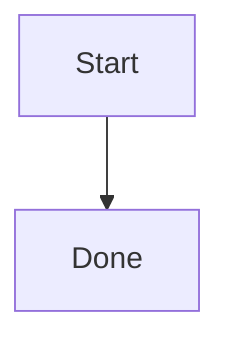

# Markdown 编辑器模型 - 多标签文件打开与切换

本文档描述编辑器中“顶部标签栏 + 多文件编辑”交互的行为。

## Agent 对话框原型

- 编辑器支持唤起浮动 Agent Palette：
  - 当编辑器内存在文字选区且仅打开 prompt 时，浮层会读取当前浏览器选区最后一行的矩形，并定位在该行正下方；此阶段只做边界收敛，不主动滚动编辑器；
  - 当没有有效选区时，浮层出现在编辑区中上方的居中位置；
  - 当用户发送消息或从折叠状态重新打开对话画布时，编辑滚动区会先把选区最后一行滚动到默认 Agent 位置的上方，再让 prompt 框贴在最后一行下方，避免画布展开后浮层出现在过低的位置；
  - 画布展开定位使用同步滚动后再重新计算位置，避免长距离平滑滚动尚未完成时 prompt 停在旧坐标；代码块和块级内容会优先使用选区起止点的折叠光标 rect，必要时再过滤整块容器 rect，只使用真实文本行 rect 定位。
  - 当画布折叠回 prompt 时，编辑器会尽量反向滚动以展示更多被选中文本；如果选区已经完整可见，或 prompt 已经到达最低安全位置，则停止移动；
  - 浮层 X 轴始终按当前编辑器视口居中，不跟随选区最后一行的横向位置，并根据编辑器视口宽度收敛自身宽度，避免超出编辑器区域。
  - Agent 打开后会用浏览器 CSS Highlight API 保留选中文本的浅蓝选中效果，避免 prompt 获得焦点后用户失去上下文。
- 当前原型监听 `Fn` 键；由于不同系统和 Electron 版本可能不会向渲染进程暴露独立 `Fn` 事件，主进程也会通过 `before-input-event` 尝试捕获并转发，同时提供 `Cmd/Ctrl + J` 作为开发验收兜底快捷键。
- Prompt 框包含：
  - 左侧 `+` 菜单，当前支持 `Web Search` 复选开关和本地文件选择；
  - 模型选择菜单，提供 `Lite`、`Pro`、`Ultra` 三档模型，并用不同图标与颜色标识，默认使用 `Lite`；
  - 主按钮在输入为空时展示语音模式，点击后切换到居中的波形动画，再次点击后模拟识别并回填文字；
  - 主按钮左侧的麦克风按钮用于“语音转文字”模式，prompt 框保持文字输入状态，按钮仅通过 icon 颜色展示浅蓝到蓝色的呼吸动画；再次点击后结束识别，并把文字插入当前光标位置；
  - 输入框自动随内容增高，最多显示四行，超过四行后进入内部滚动。
- 附件以 prompt 内部标签展示，并经过 `Uploading -> Parsing -> Recording -> Ready` 四个本地状态；当前原型只记录文件名、类型和展示状态，尚未接入真实上传、解析或索引服务。
- 发送消息后，prompt 下方展开固定高度的对话画布：
  - 每一次用户提问和 AI 回复组成一张 `qa-paper`，画布使用纵向滚动与 scroll snap，让新对话像纸张一样顶上来；
  - 新发送的对话纸张会从下方轻微上推动画进入，强化“新纸张顶上来”的卷轴感；
  - 用户消息使用带边框气泡，AI 消息直接铺在画布上，两者保持明显视觉区分；
  - 用户消息左下方按便当布局展示本轮附件，附件名过长时省略；
  - 用户消息右下方提供撤销、复制、编辑按钮，其中复制会写入剪贴板，编辑会让消息进入可编辑状态，并允许删除本轮附件；
  - 编辑确认后会用修改后的 prompt 和附件重新生成当前原型回复。
- Agent 已接入后端流式事件通道，AI 回复会在同一条消息中按 `delta` 增量显示，完成后标记为完整状态，错误时展示错误文本并触发 toast。
- AI 回复内容复用编辑器侧 `rich-markdown` 的 Markdown 渲染与 HTML 清洗能力，支持段落、列表、标题、引用、代码块、Mermaid 图表和表格等基础 Markdown；AI 回复完成后才会在回复下方显示复制按钮，用于复制原始 AI 回复文本。
- 画布浮动按钮有两种互斥状态：当用户离开最新对话纸张时，底部显示 `Back to latest`；当用户仍在最新对话但上滑打断流式自动贴底时，底部显示仅含图标的恢复自动滚动按钮。
- 用户发送新消息或点击 `Back to latest` 会进入自动贴底状态；流式输出期间会持续滚动到最新内容底部，用户上滑会打断该状态，用户滚到画布底部或点击恢复按钮会重新进入该状态。
- 画布左上 session 控件和右上折叠控件在打开或发送后短暂出现，用户 4 秒无画布操作后上滑淡出；用户上滑查看历史内容时重新出现，向下滚动时隐藏。
- 对话画布右上角按钮用于折叠画布；折叠后，如果当前 session 已有消息，prompt 工具栏右侧会出现历史按钮用于重新展开。
- `Back to latest` 只会在当前 session 至少有两轮对话，且用户滚动到非最新纸张时，从画布底部弹出。
- 对话画布左上角提供 session 控制菜单，第一个 item 固定为 `New Session`，后续 item 为从本地 `otherone-agent` 记忆中恢复的已有 session；新建 session 会通过后端 IPC 落入 Agent 本地文件存储。
- 当前 Agent 回复已经接入后端流式 Agent 服务；语音识别、Web Search 和附件真实解析仍为前端原型状态，后续需要替换为后端 API、请求拦截器和统一消息组件处理。

## Mermaid 图表渲染

- 编辑器内新增 Mermaid 图表块使用 slash command：
  - 在根级段落输入 `/` 时会打开指令选择弹层，继续输入 `/m` 会筛选出 Mermaid 指令；弹层支持鼠标点击、方向键、`Enter` 和 `Tab` 选择；
  - 在根级段落输入 `/mermaid` 并按 `Enter` 时，当前段落会替换为 Mermaid 图表块；
  - 在已有正文末尾输入 ` /mermaid` 并按 `Enter` 时，正文会保留，Mermaid 图表块会插入到下一行；
  - `正文/mermaid`、`/mermaid extra` 或命令后继续输入其他字符时都保留为普通内容。
- 保存后的 Markdown 仍使用标准 fenced code block 形式的 Mermaid 图表：

````markdown

````

- Markdown 进入编辑器时，根级 `mermaid` 代码围栏会转换为 `velocaMermaid` 原子块节点；普通语言代码块继续使用现有 Shiki 代码块，不改变原有代码块体验。
- `velocaMermaid` 节点默认显示渲染后的图表卡片；用户点击 `Edit` 后进入源码编辑状态，点击 `Save` 后更新图表源码并重新渲染，点击 `Cancel` 放弃本次编辑。
- 保存和导出编辑器 Markdown 时，Mermaid 节点始终序列化回标准 ` ```mermaid ` fenced code block，不写入 Veloca 内部 HTML 结构，保证文档可被其他 Markdown 工具读取。
- Mermaid 渲染使用官方 `mermaid` 包动态加载，避免拖慢编辑器初始启动；当前依赖为 MIT license，可用于商业项目。
- 安全策略集中在 `rich-markdown`：
  - Mermaid 使用 `startOnLoad: false`、`securityLevel: 'strict'`、`htmlLabels: false`；
  - Mermaid 输出 SVG 写入 DOM 前会再次经过 DOMPurify 清洗；
  - 禁止 `script`、`foreignObject`、事件属性和 `srcdoc` 等高风险内容。
- Agent 回复中的 Mermaid 围栏会先渲染为安全占位块，React 挂载后再异步 hydrate 为 SVG；如果渲染失败，回复区显示错误状态并保留源码内容，复制回复时仍复制原始 AI Markdown。
- Mermaid 图表渲染跟随当前深色/浅色主题；主题切换后，新渲染的图表使用对应 Mermaid theme。

## 打开文件与标签

- 文件树点击某个 Markdown 文件时，采用“打开/聚焦”策略：
  - 如果该文件已在 `openTabs` 中，直接激活或创建它对应的单文件组合，并恢复该标签的 `draftContent`；
  - 否则读取文件后新增 `openTabs` 内容项，并新增单文件组合。
- 由 `openTabs: OpenEditorTab[]`、`tabGroups: string[][]` 与 `activeTabPath: string | null` 统一管理当前打开集合、顶部选择栏组合和当前激活文件。
- `activeFile` 不再作为独立状态维护，始终由 `activeTabPath` 在 `openTabs` 中派生。
- `openTabs` 中每个文件只保存一份内容状态；同一个文件可以出现在多个 `tabGroups` 组合里。

## 草稿与切换

- 切换标签时不弹出“放弃修改”确认框，当前标签草稿会被保留在内存中。
- 每个标签保存三类状态：
  - `draftContent`：编辑缓冲内容；
  - `savedContent`：上次成功保存的内容；
  - `status`：`saving` / `saved` / `unsaved` / `failed`。
- `updateDocumentContent` 每次编辑时同时更新 `documentContent` 与对应标签的 `draftContent`。

## 关闭标签

- 每个标签右侧带关闭按钮（`X`）。
- 关闭未保存标签时弹出确认对话框：
  - `status === 'unsaved'` 提示并要求确认后可关闭；
  - 其他状态直接关闭。
- 关闭激活标签后自动激活相邻标签（优先同位，找不到则回退到前一项）；若已无剩余标签则清空编辑器。
- 关闭后清理状态：`activeTabPath`、`documentContent`、`saveStatus` 与标签集合保持一致。

## 保存

- 保存逻辑始终作用于当前激活标签：
  - 手动保存按钮、快捷键保存、自动保存都只保存激活标签；
  - 保存成功后更新该标签的 `savedContent` 与 `draftContent` 状态同步；
  - 自动保存状态监听与 `activeTabPath` 绑定。
- 顶部保存按钮的动画状态按文件路径独立维护：
  - 手动保存、快捷键保存、自动保存都会触发保存按钮的 `saving -> success -> idle` 动画；
  - 切换文件时，按钮只展示当前激活文件自己的保存动画与保存状态；
  - 某个文件保存中切换到其他文件后，原文件保存完成仍会更新自己的标签状态，不影响当前激活文件的按钮显示。

## 双文件分屏

- 顶部标签支持拖拽到另一个标签的中间区域形成双文件分屏：
  - 被拖拽文件会放到右侧编辑区；
  - 目标文件保留在左侧编辑区；
  - 两个文件都会使用独立的 `MarkdownEditor` 实例和独立滚动区域。
- 顶部拖拽反馈按“组合标签整体宽度”判断：
  - 左侧 25% 显示插入到目标组合前方的蓝色竖线；
  - 右侧 25% 显示插入到目标组合后方的蓝色竖线；
  - 中间 50% 在可形成双文件组合时显示浅蓝合并反馈。
- 分屏中的两个文件会在顶部标签栏合并为一个组合标签：
  - 组合标签内部保留左右两个文件名、各自未保存标记和各自关闭按钮；
  - 点击组合标签中的任意文件段，会激活对应编辑器；
  - 拖拽单文件组合到另一个单文件组合中部仍可触发新的分屏组合预览；
  - 组合激活时，整个组合显示白色背景和外部边框，当前文件保持高亮，同组其他文件降低对比度。
- 顶部选择栏按“组合”去重：
  - 单文件也视作一个组合，例如 `[a]`；
  - 双文件组合按文件集合去重，例如 `[a, b]` 只允许出现一次；
  - 如果 `[a, b]` 已存在，继续把 `a` 拖到 `b` 不会新增重复组合，只会激活已有组合；
  - 合并成功后，来源单文件组合与目标单文件组合会收敛为新的双文件组合，避免顶部栏留下重复入口；
  - 文件内容状态不受组合次数影响，同一个文件仍只在 `openTabs` 中维护一份草稿与保存状态。
- 分屏状态由 `splitPanePaths: [string, string] | null` 记录左右两个文件路径。
- 分屏宽度比例由 `splitPaneRatio` 记录，用户可以拖动左右编辑区之间的分隔条调整占比。
- 点击或编辑任意一侧编辑区时，该侧文件会成为当前 `activeTabPath`，侧边栏高亮、大纲和保存按钮继续跟随当前活动文件。
- 顶部菜单中的 `Split Editor Right` 会使用当前活动标签和相邻标签创建分屏；再次触发会退出分屏。
- 当分屏中的任一文件被关闭、删除、重命名后不再可用，或用户打开分屏外的文件时，分屏状态会自动清理，避免引用不存在的编辑器。
- 分屏模式下编辑安全区采用弹性间距：宽度足够时保留舒适阅读距离，空间紧张时缩小到较窄边距，仅为表格等浮动控件保留必要操作空间。

## 工作区刷新同步

- `workspace.refresh` 后会对 `openTabs` 做收敛：
  - 在新快照中不存在的路径会移除；
- 若文件重命名，使用旧路径与新路径进行映射后更新该标签元信息。
- 若当前激活标签仍存在则保留激活，不存在则回退到最近可用标签；若无可用标签则清空编辑区。

## 侧边栏折叠

- `Files / Outline` 顶部切换栏右侧提供独立侧边栏折叠按钮，文件树和大纲 tab 保持居中。
- 折叠行为只影响文件树 / 大纲侧边栏的可见宽度，不改变已打开文件、当前标签、活动大纲标题或工作区树状态。
- 侧边栏折叠后保留一个窄侧栏入口按钮，并沿用顶部切换栏的 tab 视觉，用户可以点击该按钮恢复文件树 / 大纲侧边栏。
